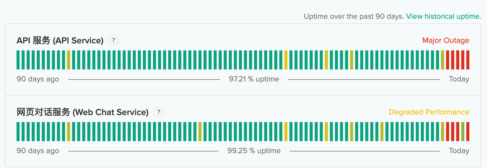
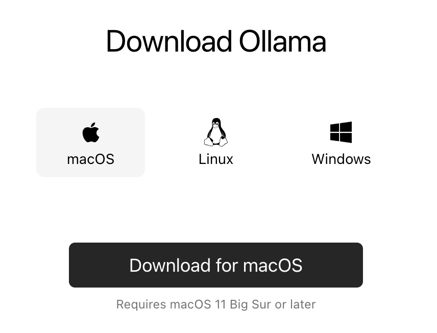
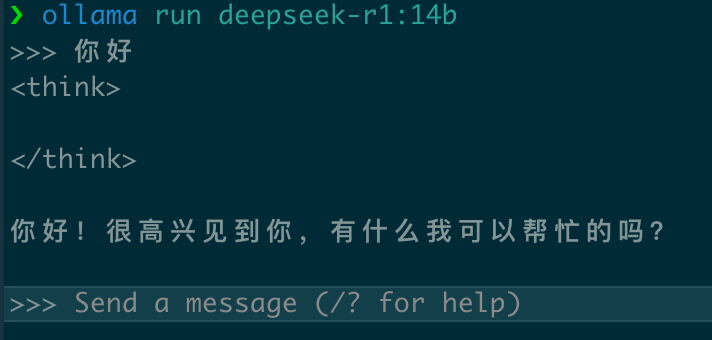

## 开篇碎碎念

还在为OpenAI的天价订阅费发愁？还在担心API被限速限额？
来来来，今天教你在家养一只属于自己的AI助手！

## DeepSeek是谁？

如果说OpenAI是AI界的"特斯拉"，那DeepSeek就是迅速崛起的"比亚迪"：

- 2023年7月刚成立，11月就发布了首个重磅产品DeepSeek Coder
- 2024年5月，推出参数量高达2360亿的DeepSeek-V2，一举将推理成本打到每百万token 1块钱（没错，就是人民币！）
- 2024年12月，更是发布了671亿参数的DeepSeek-V3，训练成本才557.6万美元，让国外同行直呼"学不会"
- 2025年1月，新发布的DeepSeek-R1更是与OpenAI的王牌O1打得有来有回，让西方媒体坐不住了

最妙的是，人家还是正儿八经的开源！模型发布即开源，这才是真·OpenAI嘛！

## 为什么要本地部署？

有两个让人头疼的原因逼着我们"自力更生"：

1. 服务不稳定
  
   看到这个界面是不是很眼熟？没错，就是那令人抓狂的"服务繁忙"...
    
   自从模型火了以来服务是越来越不稳定了...

   更要命的是有时候正聊到关键处，突然来一句"我们换个话题吧"，这谁顶得住？
2. 数据隐私安全
   作为开发者，我们经常需要让AI帮忙看代码、改Bug。但是，你愿意把公司的核心代码传到云端服务器吗？
   本地部署后，所有对话数据都在自己的电脑上，再也不用担心敏感信息泄露啦！

与其看着报错发愁，不如自己动手丰衣足食！而且DeepSeek开源的模型质量相当不错，完全可以满足日常使用。

## 实操教程：10分钟搞定你的专属AI助手

### 一、准备工作

首先，我们需要请出今天的主角：[Ollama](https://ollama.com/download)

这是一个全平台通吃的AI模型管理器，支持MacOS/Windows/Linux，安装比装个微信还简单！

### 二、模型部署

等等，别被那个671B吓到！我们不用那个需要404GB的庞然大物。
今天要部署的是它的"迷你版"：`deepseek-r1:14b`

- 这是一个基于Qwen-14b蒸馏学习而来的精巧版本
- 性能够用，体积适中，连Mac Mini M2 16G都能轻松驾驭

部署命令简单到令人发指：

```bash
ollama run deepseek-r1:14b
```

就这？对，就这！

### 三、实机测试

来看看这位"小可爱"表现如何：

简单对话测试：

看到那个`<think>`标记了吗？这是它的"思考过程"。不过对于打招呼这种简单问题，它都懒得思考了😂

复杂问题测试：


### 彩蛋时间

知道吗？通过Ollama，你不止可以养一只AI，而是可以养一百多只！完整的"AI图鉴"请看：[ollama-library](https://ollama.com/library)

## 写在最后

怎么样，是不是比想象中简单多了？
下一篇我们将介绍如何给这只AI助手穿上漂亮的"衣服"（界面开发），感兴趣的同学记得关注更新哦！

---

如果你觉得这篇文章有帮助，别忘了点赞关注，我们下期再见！
