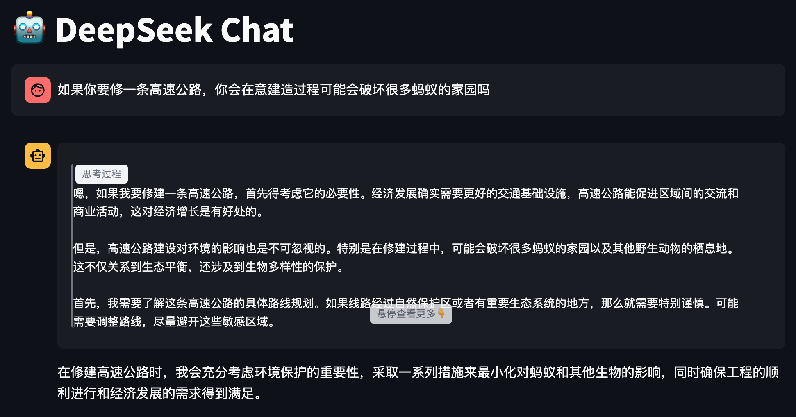

## 开篇碎碎念

你有没有觉得DeepSeek深度推理时有时候像个"话痨"，想到什么说什么，让人眼花缭乱？🤪

还记得上次我们一起打造的DeepSeek Chat界面吗？今天，我们要教会它"深思熟虑"的艺术，让它像个优雅的绅士一样，把思考过程整整齐齐地收起来，需要的时候才优雅展开~

## 设计灵感

我们的目标是打造一个优雅的思考过程展示区：
- 就像折叠的信纸，默认只露出一角
- 感兴趣的时候，轻轻一碰就能展开看到全貌
- 配上舒适的过渡动画，让交互更自然
- 清晰的视觉提示，让用户一眼就懂

## 实战教程

### 一、给思考过程穿上"新衣服"

首先创建`styles.py`文件，这就是我们的"时装设计图"：

```python
import streamlit as st

def set_think_style():
    st.markdown("""
    <style>
        code.language-think  {
            white-space: pre-wrap !important;      /* 让文字乖乖换行 */
            display: block;                        /* 霸占一整行 */
            overflow: hidden;                      /* 先藏起来 */
            max-height: 200px;                     /* 露出小脑袋 */
            transition: max-height 0.3s ease-out;  /* 优雅地展开 */
            cursor: pointer;                       /* 变身小手手 */
            position: relative;                    /* 准备好定位 */
            padding-top: 25px !important;          /* 给标签腾位置 */
            border-left: 3px solid #6c757d !important; /* 点缀一下左边 */
            margin: 10px 0 !important;             /* 上下留点空间 */
        }
        
        code.language-think::before {
            content: "思考过程";                   /* 告诉大家这是什么 */
            position: absolute;                   /* 固定位置 */
            left: 3px;                            /* 靠左站 */
            top: 1px;                             /* 靠上站 */
            background: #f3f4f6;                  /* 标签底色 */
            padding: 2px 8px;                     /* 撑开点 */
            border-radius: 4px;                   /* 圆润的角 */
            font-size: 12px;                      /* 文字要小巧 */
            color: #6b7280;                       /* 低调的颜色 */
        }
        
        code.language-think::after {
            content: "悬停查看更多👇";                /* 友好的提示 */
            position: absolute;                    /* 固定位置 */
            left: 50%;                             /* 居中 */
            bottom: 5px;                           /* 靠下 */
            transform: translateX(-50%);           /* 完美居中 */
            background: #f3f4f6;                   /* 和上面配套 */
            padding: 2px 8px;                      /* 撑开点 */
            border-radius: 4px;                    /* 圆润 */
            font-size: 12px;                       /* 小巧 */
            color: #6b7280;                        /* 协调 */
            opacity: 0.8;                          /* 半透明 */
        }
        
        code.language-think:hover::after {
            display: none;                         /* 展开时藏起提示 */
        }
        
        code.language-think:hover {
            max-height: none;                     /* 完全展开 */
            box-shadow: 0 2px 5px rgba(0,0,0,0.1); /* 加个投影 */
        }
    </style>
    """, unsafe_allow_html=True)
```

### 二、让AI学会"整理思路"

现在修改`app.py`，教会AI如何优雅地展示思考过程：

```python
# ... 前面的代码保持不变 ...

# 引入我们的"时装设计图"
from styles import set_think_style

# 应用样式
st.set_page_config(
    page_title="DeepSeek Chat",
    page_icon="🤖",
    layout="wide"
)
set_think_style()

# ... 中间的代码保持不变 ...

# 修改AI响应部分
with st.chat_message("assistant"):
    message_placeholder = st.empty()
    full_response = ""
    
    stream = client.chat(
        model='deepseek-r1:14b',
        messages=st.session_state.messages,
        stream=True,
        options={
            'temperature': temperature
        }
    )
    
    # 逐字显示回复，支持思考过程
    for chunk in stream:
        if chunk.message and chunk.message.content:
            content = chunk.message.content
            # 特殊标记转换
            if content == "<think>":
                content = "```think\n"
            elif content == "</think>":
                content = "\n```"
            full_response += content
            # 实时显示
            message_placeholder.markdown(full_response + "▌")
    
    # 最终显示
    message_placeholder.markdown(full_response)
```

### 三、效果展示

现在，当AI回答问题时，它的思考过程会被优雅地收纳起来。比如：



看！是不是感觉AI更有条理了？思考过程默默地躲在一个精致的折叠区域里，需要的时候轻轻一碰就能展开，不需要时也不会占太多空间。

## 实现原理解析

我们的魔法主要来自两个部分：

1. **标记转换机制**
   - AI输出特殊标记`<think>`时，自动转换为代码块
   - 利用自定义语言`think`来触发特殊样式

2. **CSS魔法**
   - 使用`max-height`和`transition`实现平滑展开
   - 巧妙运用`::before`和`::after`添加提示标签
   - 响应用户交互，展现不同状态

## 写在最后

通过这个小改进，我们的AI助手不仅变得更加优雅，还学会了如何更好地展示自己的思考过程。这让用户既能快速获取答案，又能按需了解AI的推理过程。

下一期，我们将继续探索更多有趣的功能，比如让AI支持多种角色切换，敬请期待！

PS: 完整代码已经上传到GitHub，欢迎来玩：[deepseek-chat-think-different-style](https://github.com/onewesong/AGIRoadCodeDemo/tree/main/deepseek-chat-think-different-style)
