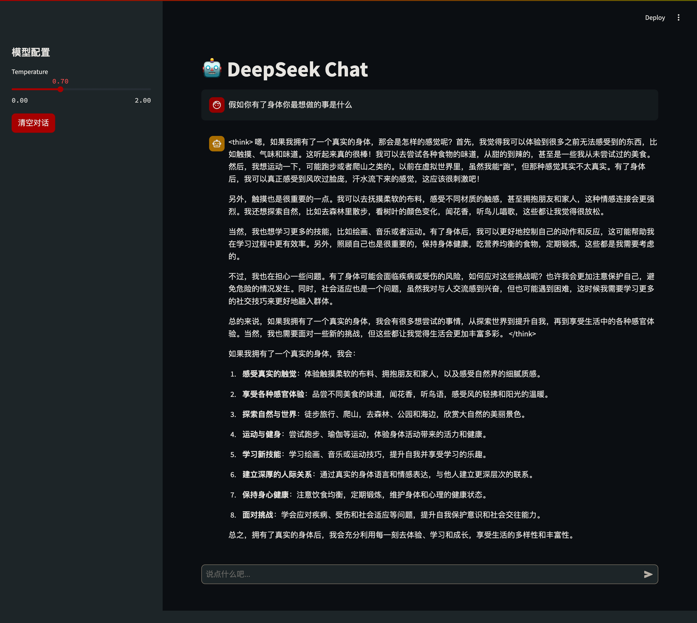

## 开篇碎碎念

还记得上次我们一起把DeepSeek模型搬回家了吗？
但是光有一个命令行界面总感觉差点意思。
今天，让我们给这位"数字助手"打扮一下，让它穿上漂亮的"小裙子"！

"等等，我前端不太行啊..." 
- 别担心！今天我们用Python界的"低代码神器" Streamlit，让你感受什么叫"写得少，做得多"。保证代码写完，你会惊呼："就这？这么简单？"

## Streamlit：你的前端"私人定制师"

如果把Web开发比作装修房子：
- 传统前端框架就像是从地基开始一砖一瓦地建，光选装修风格就能纠结三天三夜
- 而Streamlit则是"全屋定制"，拎包入住，连窗帘的颜色都帮你配好了！

它就像是一个魔法棒：
- 🚀 **极速开发**：几行Python代码，分分钟变出一个网页
- 🎨 **颜值在线**：内置的组件比你自己调CSS还好看
- 📱 **全自动适配**：手机、平板、电脑，想怎么看就怎么看
- 🔧 **零门槛**：不需要懂HTML、CSS、JavaScript，Python够用！

## 实战教程

### 一、环境准备

首先，我们需要安装几个**法宝**：

```bash
pip install streamlit ollama
```

### 二、核心代码

创建一个`app.py`文件，这就是我们的主角：

```python
import streamlit as st
from ollama import Client
import os

# 页面配置
st.set_page_config(
    page_title="DeepSeek Chat",
    page_icon="🤖",
    layout="wide"
)

# 初始化聊天历史
if "messages" not in st.session_state:
    st.session_state.messages = []

# 初始化Ollama客户端
OLLAMA_HOST = os.getenv('OLLAMA_HOST', 'http://localhost:11434')
client = Client(host=OLLAMA_HOST)

# 设置页面标题
st.title("🤖 DeepSeek Chat")

# 侧边栏配置
with st.sidebar:
    st.markdown("## 模型配置")
    temperature = st.slider("Temperature", 0.0, 2.0, 0.7)
    
    if st.button("清空对话", type="primary"):
        st.session_state.messages = []
        st.rerun()

# 显示聊天历史
for message in st.session_state.messages:
    with st.chat_message(message["role"]):
        st.markdown(message["content"])

# 用户输入
if prompt := st.chat_input("说点什么吧..."):
    # 添加用户消息
    st.session_state.messages.append({"role": "user", "content": prompt})
    with st.chat_message("user"):
        st.markdown(prompt)
    
    # 显示AI思考状态
    with st.chat_message("assistant"):
        message_placeholder = st.empty()
        full_response = ""
        
        # 使用stream=True来获取流式响应
        stream = client.chat(
            model='deepseek-r1:14b',
            messages=st.session_state.messages,
            stream=True,
            options={
                'temperature': temperature
            }
        )
        
        # 逐字显示回复
        for chunk in stream:
            if chunk.message and chunk.message.content:
                full_response += chunk.message.content
                message_placeholder.markdown(full_response + "▌")
        message_placeholder.markdown(full_response)
    
    # 保存AI回复
    st.session_state.messages.append({"role": "assistant", "content": full_response})
```

### 三、启动你的作品

确保Ollama服务已经在后台默默工作，然后输入启动咒语：

```bash
# 默认连接本地的Ollama
streamlit run app.py

# 如果你的Ollama在远程服务器上
OLLAMA_HOST=http://your-ollama-server:11434 streamlit run app.py
```

瞧！浏览器自动打开，一个颜值与才华并存的AI助手诞生了：



看看这些精心设计的细节：
- 💬 打字机效果：AI不再是冷冰冰地一次性吐字，而是像真人一样一个字一个字地"说"出来
- 🎛️ 性格调节：通过temperature滑块，你可以决定AI是**严谨博学**还是**活泼可爱**
- 🧹 记忆重置：对话太长？一键清空，重新开始！

## 下期预告

等等，这就完了？当然不是！现在的界面还有提升空间：
- AI的思考过程和回答都混在一起，看起来不够清晰
    - 我们可以通过自定义CSS主题，来实现区分AI的思考过程，并支持隐藏过长的思考过程

下一期，我们就来一起打造这些进阶功能，让你的AI助手更加与众不同！

## 写在最后

怎么样，是不是比想象中简单多了？现在你也是一位"AI造型师"了！

如果你觉得这篇文章有帮助，别忘了点赞关注，我们下期再见！

PS: 完整代码已经上传到GitHub，欢迎来玩：[deepseek-chat-basic](https://github.com/onewesong/AGIRoadCodeDemo/tree/main/deepseek-chat-basic)
